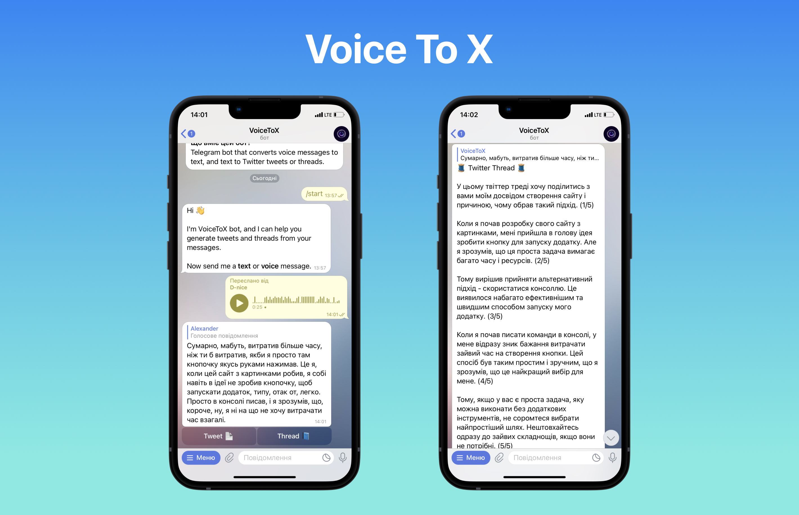

# Voice To X - Telegram bot + GPT

Telegram bot that can transcribe voice messages into text and generate tweets or threads from the provided text. [Bot link](https://t.me/VoiceToX_bot), but you need to request access using the bot's commands or host it yourself.

- [TODOs](/TODOs.md) for the future.

## How to set up

Bot uses [grammY](https://grammy.dev/) Telegram bot framework.

For environment configuration, see [.env.example](/.env.example) file. You also need [Deno](https://deno.land/) installed.

**To run** bot with `deno task dev`.

The bot is currently hosted on the [Fly](https://fly.io/) and uses [Supabase](https://supabase.com/) as a database for storing the ids of approved users. But this check and database can be easily removed. Just delete `accessMiddleware` and all its usage.

The database connection is done using [Prisma](https://www.prisma.io/). On Deno connection should be done through the [Prisma Data Platform](https://www.prisma.io/data-platform). Better check [official Deno example](https://deno.land/manual@v1.36.1/node/how_to_with_npm/prisma) on how to use Prisma

**To deploy** use `deno task deploy`.